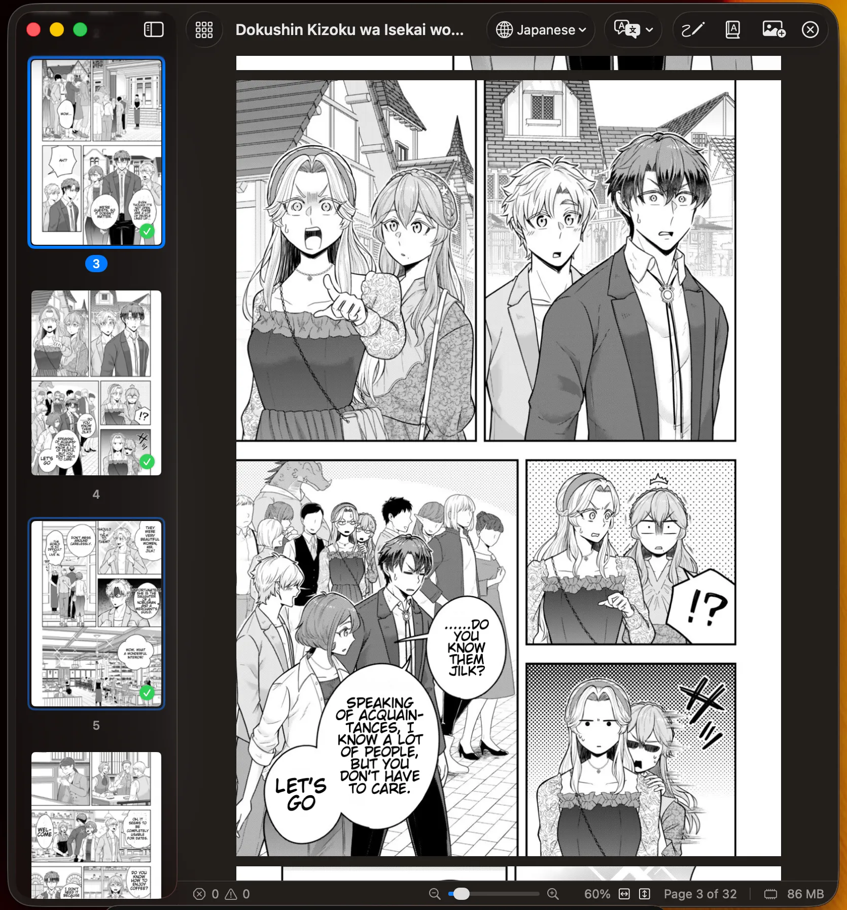
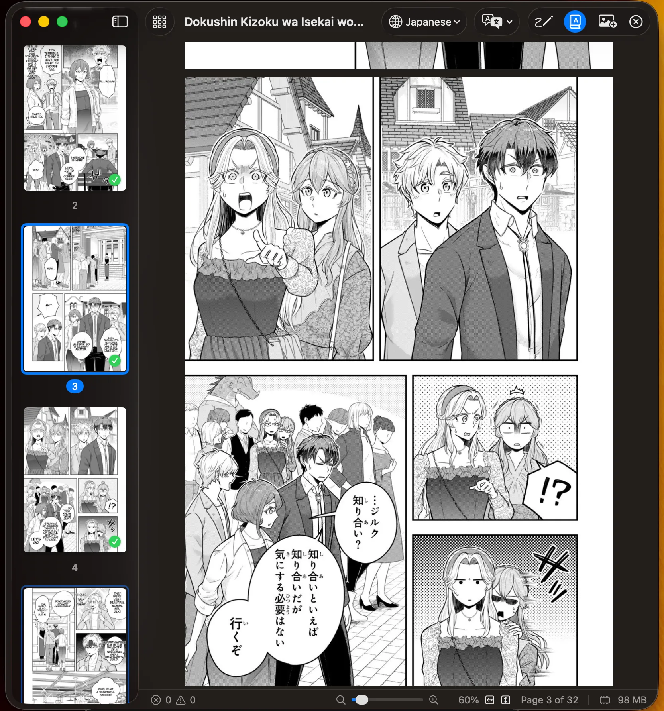
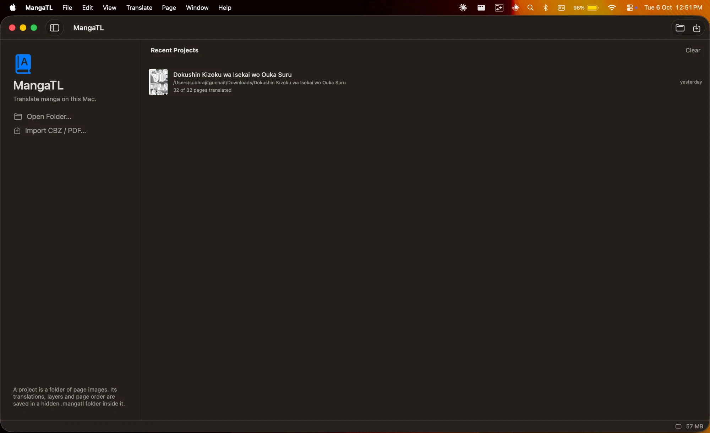
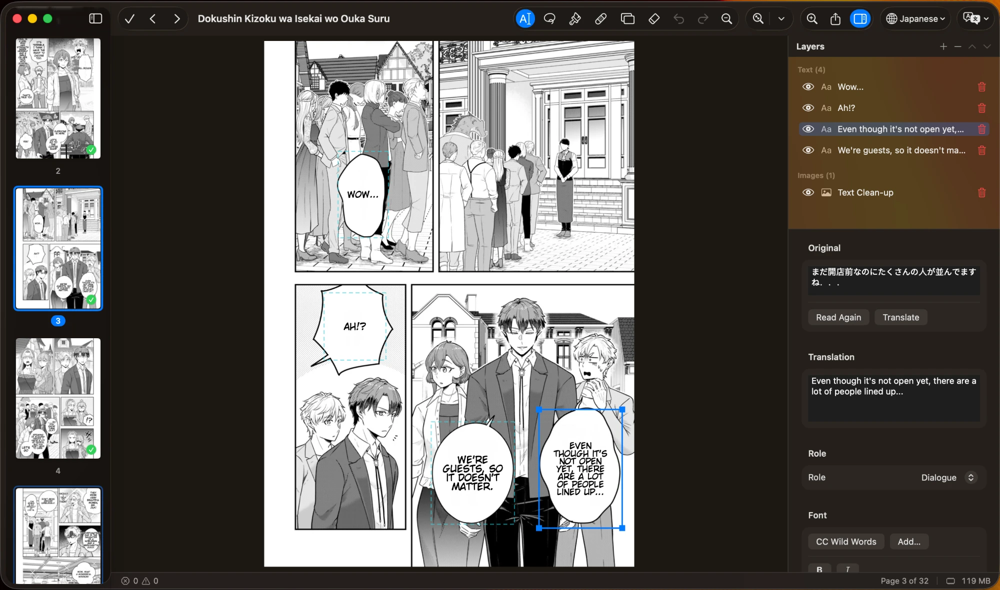
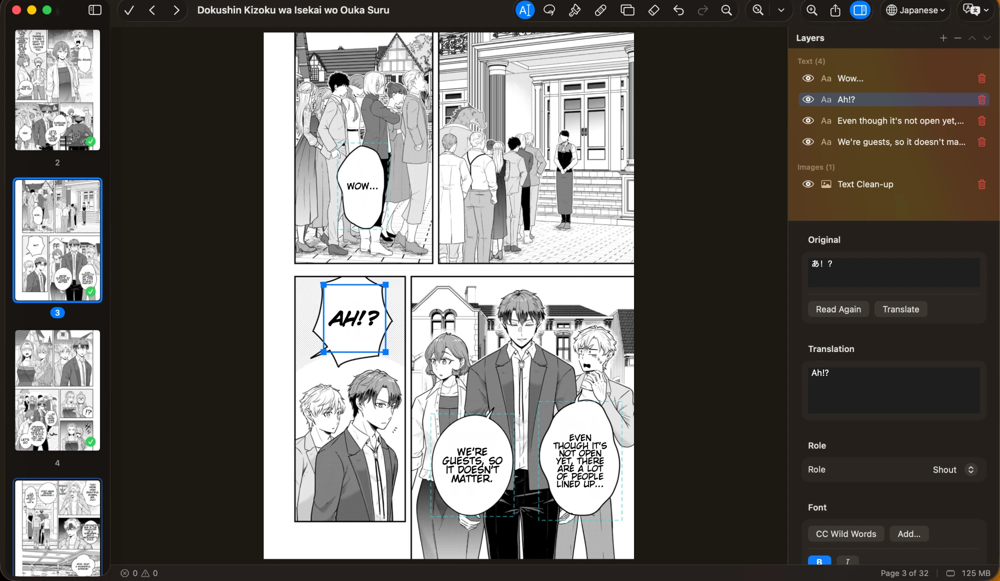

# MangaTL

**Translate manga on your Mac — privately, on-device.**

MangaTL is a native macOS app that finds the text in manga pages, reads it (Japanese, Chinese,
Korean, Spanish, French or Portuguese), translates it to English and letters it back into each
balloon. Nothing is uploaded: detection, OCR, translation and clean-up all run on your Mac.



## Highlights

- **One click per page** (⌘T), or the whole chapter (⇧⌘T). Pick the source language, or let **Auto** work it out.
- **Lettering that looks typeset:** CC Wild Words by default, text shaped to each balloon, styles per role (dialogue, thought, shout…).
- **A real editor:** move and restyle text, fix missed text with the **Lasso**, and erase or retouch with Erase, Heal (screentone-aware), Clone and Unpaint — all on layers you can undo, hide or delete.
- **Built for long books:** smooth scrolling through thousands of pages in a small memory footprint.
- **Export** to a folder of images, CBZ or PDF.

| Original | Translated |
|---|---|
|  |  |

---

## Install

MangaTL is built from source. It takes about ten minutes, most of it downloading.

### 1. Check the requirements

- A Mac with **Apple Silicon** (M1 or later) running **macOS 26** or later
- About **2 GB** of free disk space (models, thumbnails and build files)

### 2. Install the tools

Open **Terminal** and run each line below. (Already have Xcode 26 or Homebrew? Skip what you have.)

```bash
xcode-select --install
```

```bash
curl -LsSf https://astral.sh/uv/install.sh | sh
```

`xcode-select` installs Apple's command-line developer tools (Swift). [`uv`](https://docs.astral.sh/uv/)
is only used once, to download the models. Open a new Terminal window afterwards so `uv` is found.

### 3. Download MangaTL

```bash
git clone https://github.com/subh0x/MangaTL.git && cd MangaTL
```

### 4. Download the models (~150 MB)

```bash
uv venv --python 3.12 tools/.venv && uv pip install --python tools/.venv/bin/python huggingface_hub
```

```bash
tools/.venv/bin/python tools/export_models.py
```

The models are installed into `~/Library/Application Support/MangaTL/models`.

### 5. Build the app and move it to Applications

```bash
tools/bundle.sh && cp -R MangaTL.app /Applications/
```

```bash
open /Applications/MangaTL.app
```

### 6. Add the translation languages

MangaTL uses Apple's on-device translation. Open **System Settings › General › Language & Region ›
Translation Languages** and download the languages you'll read (Japanese, Chinese, Korean, Spanish,
French, Portuguese) and English. If one is missing, MangaTL tells you when you translate.

### 7. Optional: install the lettering font

The default font is **CC Wild Words**, the classic comic lettering face. Install it (double-click the
font file, then **Install**) for the intended look; without it, MangaTL uses the system font. You can
also pick any installed font, or add a TTF/OTF from inside the app.

### Updating

```bash
cd MangaTL && git pull && tools/bundle.sh && cp -R MangaTL.app /Applications/
```

Quit MangaTL (⌘Q) first. Your projects and their translations are kept.

---

## Quick start



1. **Open a project.** Click **Open Folder…** (⌘O) and choose a folder of page images, or
   **Import CBZ / PDF…** to unpack an archive into a new folder. Recent projects appear on the right.
2. **Choose the language** in the toolbar's language menu (the globe), or **Auto**.
3. **Translate.** Press **⌘T** for the page you're on, or **⇧⌘T** for every untranslated page.
   Progress shows in the status bar; anything that fails appears in the **Problems** panel with a Retry button.
4. **Fix it up.** Press **⌘E** (or double-click a page) to open the editor. Click a text box to change
   its words, role, font, size or colours in the side panel. Use ← → to move between pages.
5. **Export.** **File › Export…** (⇧⌘E) saves the pages as images, a CBZ or a PDF.

Your work is saved automatically in a hidden `.mangatl` folder inside the project folder, so the
project reopens exactly where you left off — even on another Mac.

## The editor



- **Text boxes:** click to select, ⇧/⌘-click or drag across several, drag to move, drag a corner to resize.
  Edit the translation, **Read Again** or **Translate** a single box, and set its role, font, size,
  alignment, outline and colours.
- **Lasso** (L): draw around text the app missed. It's read, translated into a new box and erased from
  the page, in one undo step.
- **Brushes:** **Erase** (E) paints with a colour, **Heal** (H) rebuilds what's behind the lettering
  (screentone stays crisp), **Clone** (C, ⌥-click to set the source), **Unpaint** (R) removes paint.
  `[` and `]` change the brush size.
- **Layers:** every text box and image layer is listed with show/hide and a red delete button.
  The translation's clean-up is its own "Text Clean-up" layer, so the original page is never changed.



**Roles** give each kind of text its own look: thoughts in italics, shouts bold and taller, and so on.
Change the look of every role in **Translate › Typesetting Presets…**.

---

## Keyboard shortcuts

| Action | Shortcut |
|---|---|
| Open folder | ⌘O |
| Translate this page / all untranslated pages | ⌘T / ⇧⌘T |
| Stop translating | ⌘. |
| Edit page / done editing | ⌘E / ⌘↩ |
| Previous / next page | ← → (editor: also ↑ ↓, ⌘[ ⌘]) |
| Zoom in / out / to fit | ⌘= / ⌘- / ⌘0 |
| Show original pages (reader) | ⌥⌘O |
| Show or hide the page sidebar | ⌃⌘S |
| Show or hide the editor's side panel | ⌥⌘I |
| Problems panel | ⇧⌘M |
| Export / export this page | ⇧⌘E / ⌥⌘E |
| Undo / redo | ⌘Z / ⇧⌘Z |
| Editor tools: Text, Lasso, Erase, Heal, Clone, Unpaint | T, L, E, H, C, R |
| Close project | ⇧⌘W |

## More features

<details>
<summary><b>Pages and projects</b></summary>

- Drag pages to reorder them in the grid or the sidebar. Drop image files on the grid, or use **Add Images**, to copy them in.
- Images added to the folder in Finder join the project automatically, in name order.
- ⌘/⇧-click several pages in the sidebar and press Delete to remove them from the project (the files stay in the folder; **Add Images** brings them back).
- Thumbnails show your translations and edits.
- The `.mangatl` folder holds `project.json` (settings, page order, last position), `pages/` (one file per translated page), `layers/` (one PNG per image layer) and `fonts/`. Image files are never renamed or deleted.

</details>

<details>
<summary><b>Translation</b></summary>

- **Auto** language identifies each page's language from its text when it's translated; the menu then shows it (e.g. "Auto · Japanese").
- Translating again from inside the editor keeps your own retouch layers.
- The **Problems** panel lists failures and pages where no text was found, with **Retry** and **Go to Page**.

</details>

<details>
<summary><b>Viewing</b></summary>

- The grid shows every page; the reader scrolls through them at full size. Zoom with the status-bar controls, ⌘±, or a trackpad pinch; Fit Width and Fit Height are one click.
- The page sidebar (⌃⌘S) jumps to any page and shows which are translated (✓).

</details>

<details>
<summary><b>Export options</b></summary>

- **Pages:** all, current or selected, a range, or translated pages only.
- **Content:** final, clean (text removed, no new text), text layer only (transparent PNG), or original.
- **Format:** JPEG, PNG or HEIC, at original, working or custom size.
- **Package:** a folder of images (with a file-name pattern), a CBZ or a PDF.

</details>

## Troubleshooting

| Problem | Fix |
|---|---|
| "OCR models not found" when translating | Run step 4 again: `tools/.venv/bin/python tools/export_models.py` |
| A language can't be translated | Download it (and English) in **System Settings › General › Language & Region › Translation Languages** |
| Text isn't in comic lettering | Install **CC Wild Words**, or choose another font in the editor or Typesetting Presets |
| Some text wasn't found | Open the page in the editor (⌘E) and draw around it with the **Lasso** (L) |
| `xcode-select` or `swift` not found | Run `xcode-select --install`, then open a new Terminal window |
| The app won't open after building | Make sure you're on macOS 26 or later on Apple Silicon, then rebuild with `tools/bundle.sh` |

---

## How it works

| Stage | Model / API | Peak memory (measured) |
|---|---|---|
| Find balloons + text | ogkalu RT-DETR-v2 v4-s int8 (ONNX) | +72 MB |
| OCR ja / zh | Baberu OCR int4/int8 (ONNX), Koharu's manga OCR | +109 MB |
| OCR ko / es / fr / pt | Apple Vision | +55 MB |
| Translate | Apple Translation (`translationd`, separate process) | 230–280 MB while active, exits when idle |
| Erase | Flat fill on plain balloons, lattice copy on screentone, AOT-GAN (ONNX) on other artwork, 256² tiles | +7 MB |

Only one model is loaded at a time; ONNX Runtime runs through its C API with the CPU arena off, and the
app runs with `MallocSpaceEfficient=1` so freed model memory goes back to the system. Typical footprint:
about 165 MB while translating, about 230 MB while healing in the editor, about 160 MB while scrolling
2,500 pages. Koharu's newer RF-DETR layout model was evaluated and rejected: it needed 0.5–2.8 GB of RAM
(see `spike/PHASE0.md`).

## For developers

See [CONTRIBUTING.md](CONTRIBUTING.md) for tests, sample pages, the smoke run and ground rules, and
[docs/ARCHITECTURE.md](docs/ARCHITECTURE.md) for how the pieces fit. Changes are listed in
[CHANGELOG.md](CHANGELOG.md).

**Roadmap:** context-aware chapter polish (glossary, consistency, typo fixes) with swappable models —
[docs/roadmap/chapter-polish.md](docs/roadmap/chapter-polish.md).

## Licence and credits

MangaTL's code is released under the [MIT licence](LICENSE).

The models are downloaded separately and keep their own terms:

- [ogkalu/comic-text-and-bubble-detector](https://huggingface.co/ogkalu/comic-text-and-bubble-detector) (RT-DETR-v2): bubble and text detection
- [genshiai-daichi/baberu-ocr](https://huggingface.co/genshiai-daichi/baberu-ocr): Japanese/Chinese manga OCR
- [ogkalu/aot-inpainting](https://huggingface.co/ogkalu/aot-inpainting): AOT-GAN inpainting, from manga-image-translator

These weights were trained on **Manga109** data, which is licensed for **non-commercial / academic use only**.

Also built on [Koharu](https://github.com/koharu-rs/koharu) (MIT/Apache-2.0; model choices and pipeline design),
[ZIPFoundation](https://github.com/weichsel/ZIPFoundation) and [ONNX Runtime](https://github.com/microsoft/onnxruntime).

Sample pages used by the tests: [Pepper&Carrot](https://www.peppercarrot.com) by David Revoy, CC-BY 4.0,
downloaded by `tools/fetch_samples.sh`. The manga pages in the screenshots belong to their respective
copyright holders and are shown only to illustrate the app.

Projects opened in older builds (whose work was kept in `~/Library/Application Support/MangaTL/projects/`)
are copied into the folder's `.mangatl/` the first time they're opened; the old copy is left in place.
